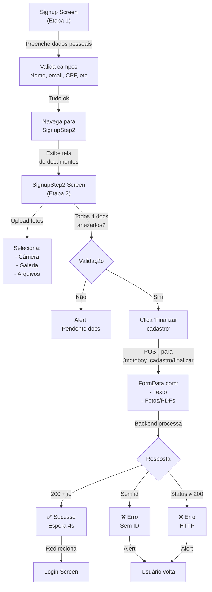

# Análise Exata: Rota `/motoboy_cadastro` (Processo de Cadastro do App)

## 🎯 Visão Geral

O app envia dados de cadastro em **2 etapas**:
1. **Etapa 1 (SignupScreen)**: Coleta dados textuais, NÃO envia para backend
2. **Etapa 2 (SignupStep2Screen)**: Coleta documentos e envia TUDO para `/motoboy_cadastro/finalizar`

---

## 📤 O QUE O APP ENVIA

### Local: `src/api/signup.ts` → `finalizarCadastro()`

O app envia uma requisição **POST com FormData** para:
```
POST /motoboy_cadastro/finalizar
Content-Type: multipart/form-data
```

### Campos de Texto (FormData)

```javascript
{
  // Pessoal
  nome: string,                    // ex: "João Silva"
  celular: string,                 // ex: "(85) 98765-4321"
  email: string,                   // ex: "joao@email.com"
  endereco: string,                // ex: "Rua X, 123, Bairro, Cidade"
  nascimento: string,              // ex: "01/01/1990" (dd/mm/aaaa OU pode enviar normalizado)
  cpf: string,                     // ex: "123.456.789-00"
  cnpj: string | "",               // ex: "12.345.678/0000-90" (OPCIONAL)

  // Veículo
  modal: string,                   // ex: "moto", "carro", "bike", "van", "outro"
  placa: string,                   // ex: "ABC-1234"

  // Pagamento - Escolha 1: PIX
  pay_method: "PIX" | "BANCO",
  pix_type: string | "",           // "cpf", "cnpj", "celular", "email", "aleatoria"
  pix_key: string | "",            // A chave PIX propriamente dita
  pix_bank: string | "",           // Banco onde a chave está registrada (OPCIONAL)

  // Pagamento - Escolha 2: Banco
  bank_name: string | "",          // ex: "bb", "bradesco", "itau", etc
  agencia: string | "",            // ex: "0001"
  conta: string | "",              // ex: "123456-0"
}
```

### Arquivos (FormData com arrays)

```javascript
// Foto do entregador (apenas 1 esperado na maioria dos casos, mas suporta múltiplos)
foto_entregador[]
  ├─ file: LocalFile { uri, type, name }
  └─ ... (pode ser mais de 1)

// Documento do entregador (RG/CNH - pode ter múltiplos para frente + verso)
doc_entregador[]
  ├─ file: LocalFile { uri, type, name }
  └─ ... (pode ser mais de 1)

// Documento do veículo (CRLV - pode ter múltiplos)
doc_veiculo[]
  ├─ file: LocalFile { uri, type, name }
  └─ ... (pode ser mais de 1)

// Comprovante de residência (1 esperado)
comprovante_residencia
  └─ file: LocalFile { uri, type, name }
```

### Exemplo de Arquivo (LocalFile)

```typescript
{
  uri: "file:///cache/IMG_123.jpg" | "content://...",
  type: "image/jpeg" | "application/pdf" | "application/octet-stream",
  name: "selfie_0.jpg" | "doc_pessoa_0.jpg" | "doc_veiculo_0.jpg" | "comp_resid_0.jpg",
  size: 245000  // em bytes (OPCIONAL)
}
```

### Dado Adicional (para Debug)

O app também envia:
```javascript
{
  anexos_resumo: JSON.stringify({
    doc_veiculo: [ { kind, name, size, mimeType }, ... ],
    doc_entregador: [ { kind, name, size, mimeType }, ... ],
    foto_entregador: [ { kind, name, size, mimeType }, ... ],
    comprovante_residencia: [ { kind, name, size, mimeType }, ... ]
  })
}
```

---

## 📥 O QUE O APP ESPERA DE VOLTA

### Resposta Esperada

```json
{
  "id": "uuid-ou-numero",
  ... (outros campos opcionais)
}
```

### Status HTTP

- **200 OK**: Cadastro realizado com sucesso
- **Qualquer outro**: Falha
  - O app tenta extrair o texto da resposta com `await res.text()`
  - Lança erro com `Falha ao finalizar (${status}): ${text}`

### Comportamento Pós-Sucesso

1. Verifica se `response.id` existe
2. Se não houver `id`: lança erro `"Servidor não retornou ID do cadastro (finalizar)."`
3. Se houver `id`: 
   - Mostra modal de sucesso ("Cadastro realizado com sucesso!")
   - Aguarda 4 segundos
   - Redireciona para tela de **Login**

---

## 🔄 Fluxo Completo



---

## 📋 Validações do App

**Na Etapa 1:**
- Campos obrigatórios: nome, celular, email, endereço, modal, placa, nascimento, cpf
- Formato: 
  - Celular: `(XX) XXXXX-XXXX`
  - CPF: `XXX.XXX.XXX-XX`
  - Data: `DD/MM/AAAA`
  - Placa: `XXX-XXXX`
- PIX OU Banco obrigatório
  - Se PIX: tipo + chave obrigatórios
  - Se Banco: banco + agência + conta obrigatórios

**Na Etapa 2:**
- **4 documentos OBRIGATÓRIOS:**
  1. `foto_entregador` (selfie)
  2. `doc_entregador` (RG/CNH)
  3. `doc_veiculo` (CRLV)
  4. `comprovante_residencia` (água/luz/internet/etc)
- Se algum faltar: bloqueia e exibe alert

---

## 🔗 Endpoints Relacionados

```typescript
// Paths definidos em src/services/api.ts:
- SIGNUP_CREATE_PATH = "/motoboy_cadastro"          // (não usado atualmente)
- SIGNUP_FINALIZE_PATH = "/motoboy_cadastro/finalizar"  // ← USADO
- PING_HEALTH_PATH = "/_health/motoboy_cadastro"   // Health check (ping)
- CHECK_PHONE_PATH = "/api/motoboy/login/check-phone"   // Para validar duplicação
```

---

## 💡 Pontos Importantes

1. **Dados textuais NÃO são enviados na Etapa 1**: O app apenas navega, os dados vão TUDO junto na Etapa 2.

2. **Sem validação de duplicação de CPF/email**: O app não checa antes (talvez na Etapa 2 o backend o faça).

3. **FormData automático**: O app NÃO define `Content-Type` manualmente, deixa o fetch/axios definir (com boundary).

4. **Obrigatoriedade do ID**: Sem `response.id`, falha.

5. **Redirecionamento pós-sucesso**: Sempre vai para Login, não para Dashboard/Home.

6. **Documentos opcionais em quantidade**: 
   - `foto_entregador[]` - múltiplos com `[]`
   - `doc_entregador[]` - múltiplos com `[]`
   - `doc_veiculo[]` - múltiplos com `[]`
   - `comprovante_residencia` - SEM `[]` (esperado apenas 1)

## 🚀 Resumo para Implementação no Backend

Para aceitar a rota `/motoboy_cadastro/finalizar`:

1. ✅ **Aceitar POST com FormData**
2. ✅ **Extrair campos de texto** (nome, celular, email, etc)
3. ✅ **Extrair arrays de arquivos**:
   - `foto_entregador[]` → múltiplos arquivos
   - `doc_entregador[]` → múltiplos arquivos
   - `doc_veiculo[]` → múltiplos arquivos
   - `comprovante_residencia` → 1 arquivo
4. ✅ **Validar** obrigatoriedade de todos os 4 documentos
5. ✅ **Processar** (salvar arquivos, BD, etc)
6. ✅ **Retornar JSON** com pelo menos `{ "id": "..." }`
7. ✅ **Status HTTP** 200 em sucesso, outro em erro

---

**Arquivo gerado em**: `/home/kron/apps/sigma/sigmha/entregador_app/ANALISE_MOTOBOY_CADASTRO.md`
